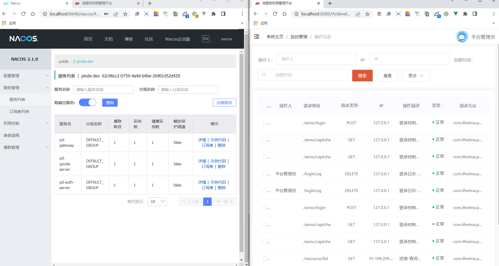
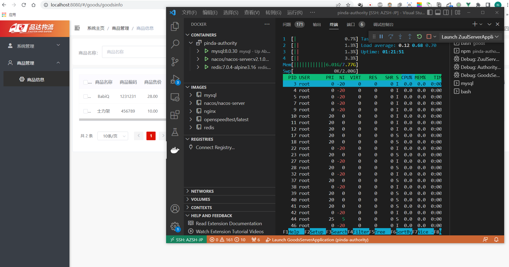
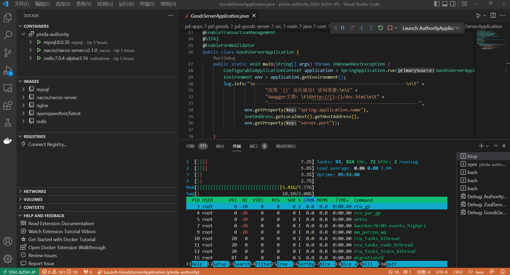

# 配置环境

## 配置docker环境

```bash
# 建表
mysql -h 127.0.0.1 -uroot -pabc123456
source nacos.sql
source pd_auth.sql
source pd_goods_info.sql

# 进入nacos
docker exec -it nacos bash

# 导入其他服务在nacos的配置信息

```

## 启动后端

- 后端通过docker-compose启动

```bash
docker-compose up -d
```

- 启动网关服务 `ZuulServerApplication`

- 启动权限服务 `AuthorityApplication`

## 启动前端

前端代码的依赖非常古老了，有些依赖甚至于已经删除，所以不能清空所有依赖重新构建。
Window与Linux系统不同的地方在于node-sass，拉取对应版本的node-sass即可.
- 原代码在windows运行，在linux运行需要处理如下：

```bash
# 重命名node-sass，安装linux版本的node-sass
chmod -R a+x node_modules/
mv node_modules/node-sass node_modules/node-sassbak

# 重新安装
npm install --unsafe-perm node-sass

# 特别提醒，版本对应问题.
"""
node -v
v13.14.0

npm -v
6.14.4
"""

# 安装node-sass,不出意外是: "version": "4.14.1",其他版本可能出错！
npm install --unsafe-perm node-sass

# 修改npm源方式
# 可以安装cnpm
npm install -g cnpm --registry=https://registry.npm.taobao.org
cnpm -v

# 两个源:npm版本>7需要使用SSL1.2,应该是需用https而不是http.
# 不过应该可以显示方式用http安装的.
npm config set registry https://registry.npm.taobao.org/
npm config set registry https://registry.npmjs.org/

# 确认是否真的修改.
npm config get registry

# 带版本安装？
npm install  --unsafe-perm node-sass node-sass@4.13.1 
```

- 启动前端

```bash
# 不出意外可以正常运行.
npm run dev
```

## 运行展示

- 前端文件偏大






